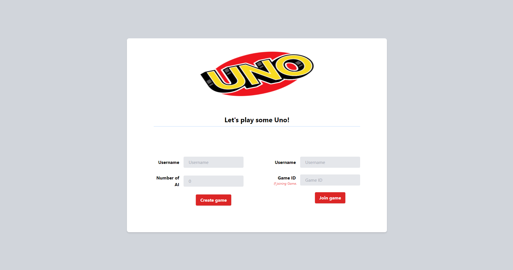
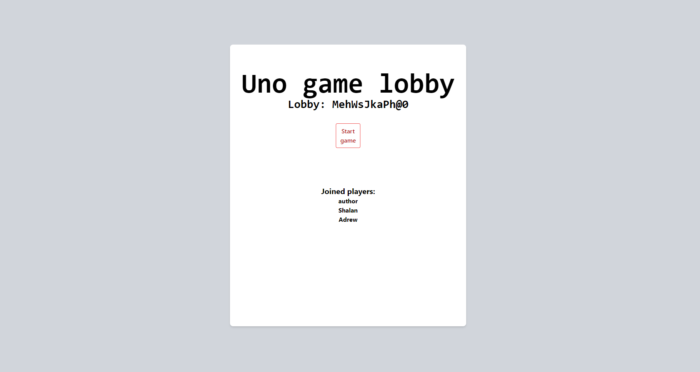
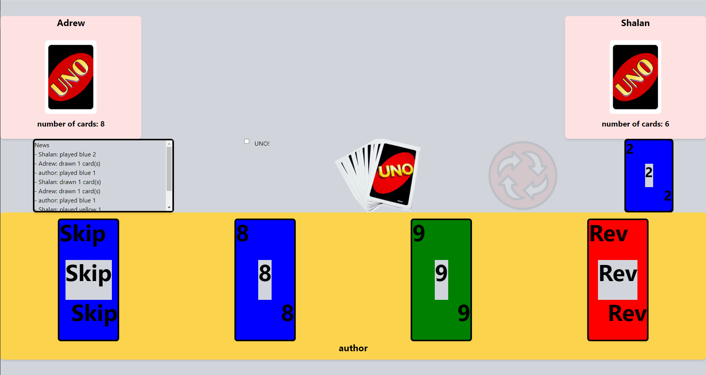
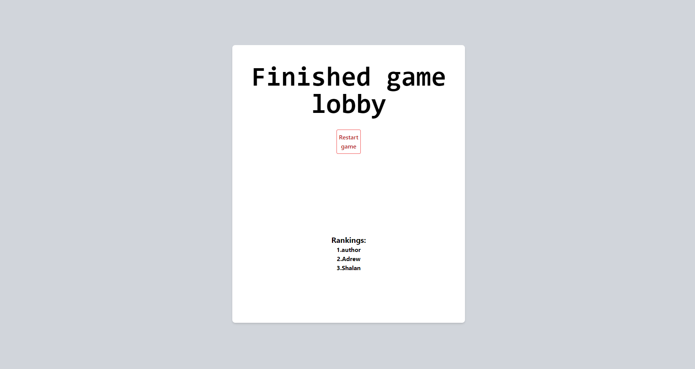

# Web implementation of the card game UNO using Rust and WebAssembly

## Authors:
 - [mazanec202](https://github.com/mazanec202) - PM, Load Balancer
 - [Were42](https://github.com/Were42) - Frontend
 - [Karolina42](https://github.com/Karolina42) - Game Server (presentation layer)
 - [AurumTheEnd](https://github.com/AurumTheEnd) - Game Server (domain layer)

Created as a final project in the course PV281 - Rust programming [@FI MUNI](https://www.fi.muni.cz/)

## Usage

This monorepo is composed of branches:
 - `main` - containing Game Server using
 - `main-lb` - containing Load Balancer

Both branches are deployable (tested on Heroku).

*There should be always one Load Balancer instance and at least one Game Server instance running (multiple Game Servers are possible).*

**Before deployment**

Whenever deploying, you need to modify `main-lb/frontend/src/url.rs` constants to aim to the URL of the Load Balancer and run `trunk build` in the folder `main-lb/frontend/`. This rebuilds the frontend application that will be served to the client.

### Deploy to Heroku

1. Deploy Load Balancer
2. Modify content of `main/Procfile` to:
```
web: ./target/release/backend -s <URL of the Load Balancer>
```
3. Deploy Game Server (it will automatically connect to the Load Balancer)

### Run locally

1. Run Load Balancer:
```
cargo run [-p <port - default 9900>]
```
2. Run Game Server - in the brackets are values to use if you did not modify any port.
```
cargo run [-p <port - default 9000>] -s <URL of the GS (localhost:9000) -l <URL of the LB (localhost:9900)>>
```

##FAQ

**I restarted the Load Balancer *(or started GS before LB)* and it does not know about any Game Servers**

Make a `PUT` request to `http://<GS URL>/restart`, this will make the Game Server reconnect to the Load Balancer.

## Screenshots:

**Home page**


**Game lobby**
One player **author** and two AIs **Shalan** and **Adrew**.


**Mid-game**
author's turn


**Overview of a finished game**
